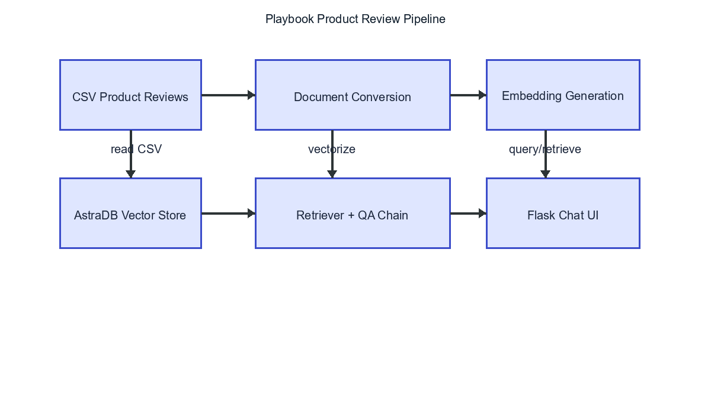

# Playbook Product Review

A Flask-based conversational product review assistant built with LangChain, Groq LLMs, AstraDB vector storage, and Hugging Face embeddings.

## Project Overview

This repository demonstrates a retrieval-augmented generation (RAG) pipeline for answering product review queries using a dataset of product titles and reviews.

The app:
- ingests review data from `data/playbook_product_review.csv`
- converts reviews into LangChain `Document` objects
- embeds documents using Hugging Face endpoint embeddings
- stores embeddings in AstraDB
- builds a conversational retrieval chain with Groq LLM
- serves a simple chat UI via Flask

## Repository Structure

- `app.py` - Flask application and runtime entry point
- `requirements.txt` - Python dependencies
- `setup.py` - package install setup
- `data/playbook_product_review.csv` - source dataset
- `playbook_product_review/`
  - `__init__.py`
  - `data_converter.py` - loads CSV and creates LangChain documents
  - `data_ingestion.py` - builds vector store and optionally ingests documents
  - `retriever_generation.py` - constructs history-aware conversational RAG chain
- `templates/chat.html` - chat UI template
- `static/style.css` - front-end styling
- `pipeline.png` - visual pipeline diagram

## Workflow

1. Load environment variables from `.env`.
2. Read `data/playbook_product_review.csv`.
3. Convert rows into document metadata and content.
4. Create embeddings using `sentence-transformers/all-MiniLM-L6-v2`.
5. Store embeddings in AstraDB vector store.
6. Create a retriever and history-aware retriever using LangChain.
7. Build a Groq-powered RAG chain that answers user queries from review context.
8. Serve chat requests through Flask at `/` and `/get`.

## Pipeline Diagram



## Setup

1. Create a virtual environment and activate it (Windows example):
   ```powershell
   python -m venv venv
   .\venv\Scripts\Activate.ps1
   ```

2. Install dependencies:
   ```powershell
   pip install -r requirements.txt
   ```

3. Create a `.env` file with the following values:
   ```text
   GROQ_API_KEY=your_groq_api_key
   ASTREA_DB_API_ENDPOINT=your_astra_api_endpoint
   ASTREA_DB_APPICATION_TOKEN=your_astra_token
   ASTRA_DB_KEYSPACE=your_astra_keyspace
   HUGGINGFACE_TOKEN=your_huggingface_token
   ```

> Note: The current code reads `ASTREA_DB_APPICATION_TOKEN` as written in `setup.py` and `data_ingestion.py`.

## Running the App

1. Start the Flask app:
   ```powershell
   python app.py
   ```

2. Open a browser to `http://127.0.0.1:5000`.

3. Enter product or review questions in the chat UI.

## Data Ingestion

To ingest the dataset into AstraDB vector storage, run the ingestion script with status set to `none`:

```powershell
python -c "from playbook_product_review.data_ingestion import data_ingestion; data_ingestion('none')"
```

This will convert the CSV rows into documents and add them to the vector store.

## Notes

- `app.py` uses `ChatGroq` with `llama-3.1-70b-versatile` at runtime.
- `playbook_product_review/retriever_generation.py` uses `llama-3.1-8b-instant` for retriever question reformulation.
- The chat chain is history-aware, so follow-up questions can reference prior messages.

## Troubleshooting

- Ensure the expected virtual environment is active before running the app.
- Confirm `GROQ_API_KEY` is present in environment variables.
- Verify Astra DB connection variables are correct.
- If embeddings ingestion fails, check that `HUGGINGFACE_TOKEN` is valid.
